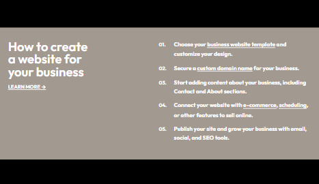
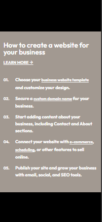
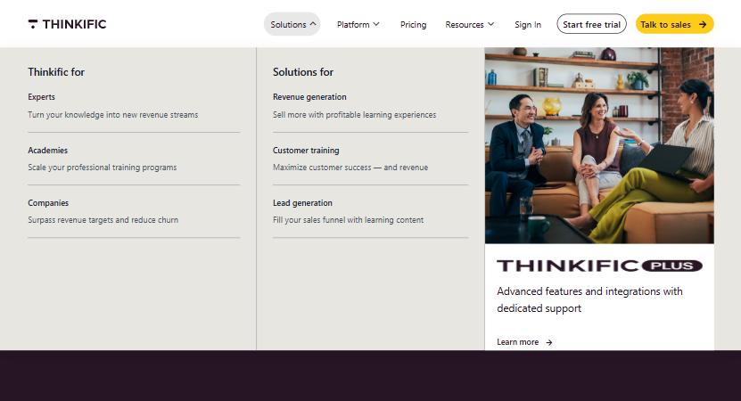
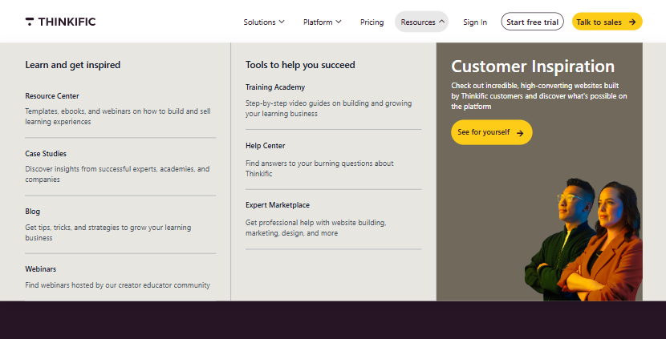
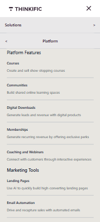

# internship_2025
# 🌟 Steps Page

This  demonstrates a simple steps for how to create website layout styled using utility-first classes.

---

## 🖼️ Screenshots

### 🖥️ Desktop View

### 📱 Mobile View

---

## 🔗 Live Demo

👉 [View it on GitHub Pages](https://imannesredin.github.io/portion_of_landing-page/)

---

# 🌟 Thikific Header
Simple header navigations for the website

## 🖼️ Screenshots

### 🖥️ Desktop View

### 📱 Mobile View

---

## 🔗 Live Demo

👉 [View it on GitHub Pages](https://imannesredin.github.io/Thinkific_head/)

---

## 🧰 Technologies Used

- HTML5
- Tailwind CSS
- JavaScript

---
